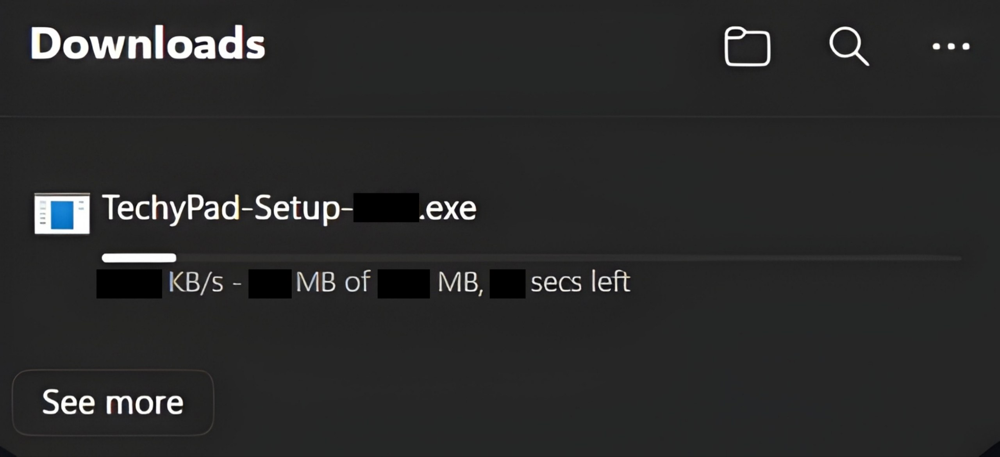
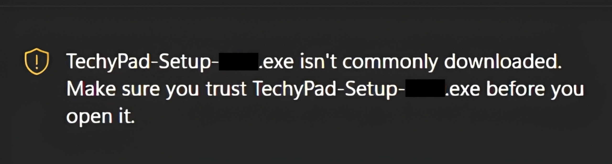
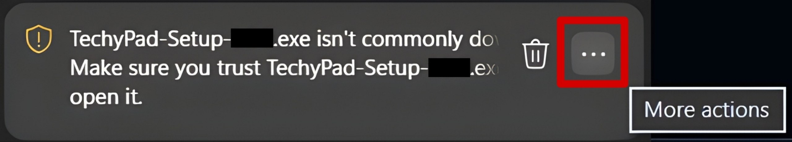
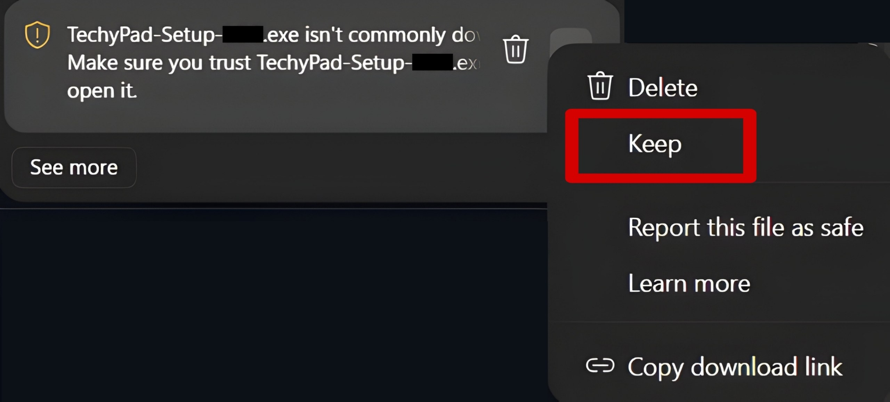
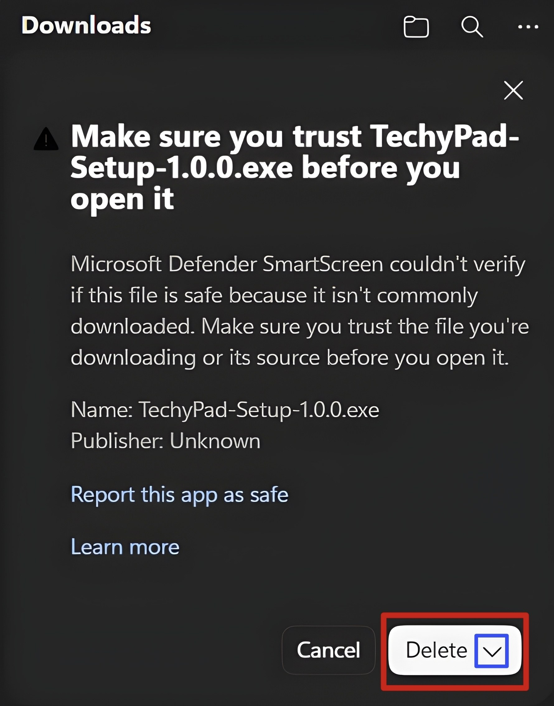
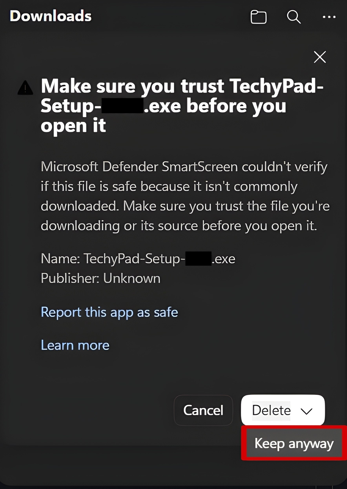
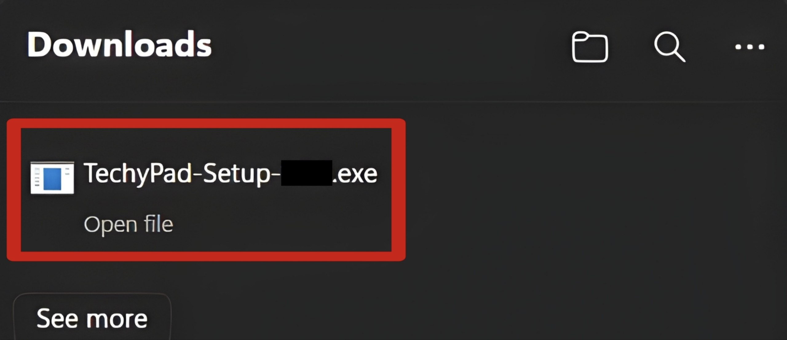
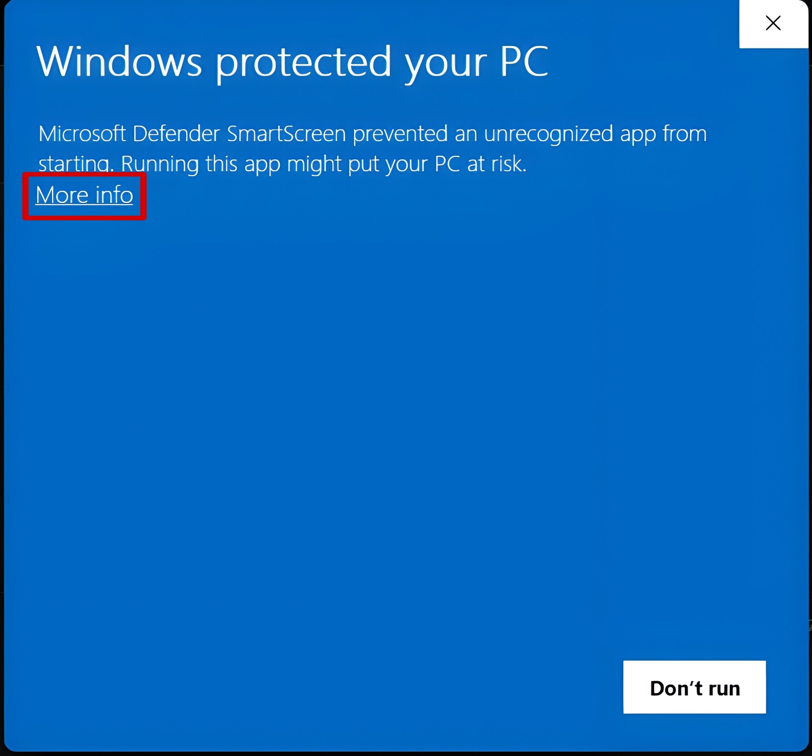
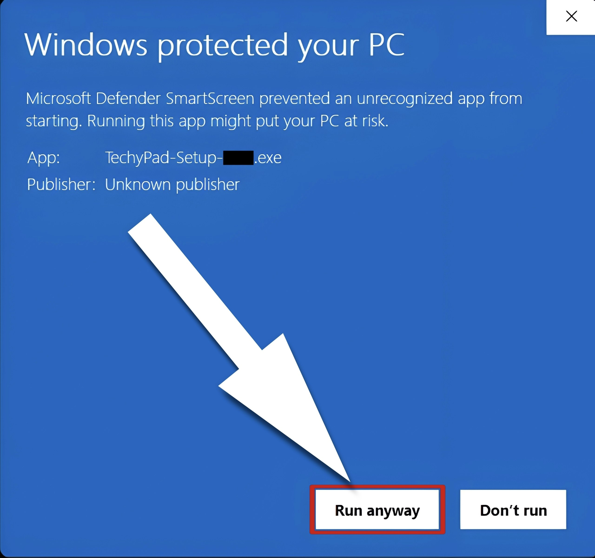

# 

# 
🚀 TechyPad — Smart Control Device

  
  
  
  

  <strong>TechyPad</strong> is a next-generation smart control hardware device designed to simplify your workflow, enhance productivity, and give you complete control — all from one powerful interface. Combining an ESP32-S3 custom microcontroller platform with a sleek, low-latency Qt/QML-based desktop companion app, TechyPad delivers premium tactile control directly to your desktop.

---

## 📌 Table of Contents

* [✨ Features](#-features)
* [📦 Downloads](#-downloads)
* [🖥️ Step-by-Step Installation & Warning Guide](#️-step-by-step-installation--warning-guide)
  * [🌐 Phase 1: Browser Download Bypasses (Chrome / Edge)](#-phase-1-browser-download-bypasses-chrome--edge)
  * [🛡️ Phase 2: Windows Defender SmartScreen Bypasses](#️-phase-2-windows-defender-smartscreen-bypasses)
  * [💾 Installation Options (Installer vs Portable)](#-installation-options-installer-vs-portable)
* [🔌 Getting Started](#-getting-started)
* [⚙️ Smart Firmware Updates](#️-smart-firmware-updates)
* [🛡️ Security & IP Architecture](#️-security--ip-architecture)
* [🛠️ Troubleshooting FAQ](#️-troubleshooting-faq)
* [❤️ Support TechyPad (Donations)](#️-support-techypad-donations)
* [👨‍💻 Author](#-Author)

---

## ✨ Features

* 🎛️ **Fully Customizable Interface** — Map keystrokes, shortcuts, macros, and smart profiles effortlessly.
* ⚡ **Ultra-Low Latency** — Optimized high-speed USB HID communication protocols.
* 🔌 **Plug-and-Play USB** — Instant device detection across modern setups.
* 🧠 **Smart Workflow Automation** — Build macros and launch applications with a single tap.
* 🖥️ **Premium Desktop Companion** — Gorgeous modern Qt/QML desktop application styled in Matte Black & Teal Blue.
* 🔄 **Seamless OTA Firmware Updates** — Update your device's core system in seconds directly through the desktop app.
* 💡 **Minimalist, Distraction-Free Design** — Beautiful aesthetics engineered for productivity.

---

## 📦 Downloads

👉 Access the latest compiled packages from the official [**GitHub Releases**](https://github.com/Jnyananjan/techy_pad/releases) page.

We package official releases into two distinct formats:
* 💿 **Installer Version (`.exe`)** — Installs shortcuts and sets up files cleanly. Recommended for standard use.
* 📦 **Portable Version (`.zip`)** — Run directly from any folder without system installation.

> [!WARNING]
> Only download TechyPad packages from the official releases section of this GitHub repository to ensure file integrity, authenticity, and maximum safety.

---

## 🖥️ Step-by-Step Installation & Warning Guide

Since TechyPad is custom-developed, high-performance hardware companion software, the application is currently self-signed (unsigned with Microsoft Authenticode credentials). As a result, Chromium-based web browsers (Google Chrome & Microsoft Edge) and Windows Defender SmartScreen will trigger precautionary warnings during download and installation.

**Rest assured, these are standard warnings for independent open-source software and are completely safe to bypass.**

Here is our visual **9-step guide** to safely download, bypass protection, and run TechyPad:

---

### 🌐 Phase 1: Browser Download Bypasses (Chrome / Edge)

#### **Step 1: Start the Download**
Click on the download link in the official [Releases](https://github.com/Jnyananjan/techy_pad/releases) section. Your browser (Chrome or Edge) will start downloading `TechyPad-Setup.exe`. Wait for the download progress bar to complete.

  
   <em>Step 1: Wait for the installer download progress bar to finish.</em>

#### **Step 2: Note the Browser Block**
Once completed, the browser will pause the save process and flag the file as uncommonly downloaded.
> ⚠️ *`TechyPad-Setup.exe isn't commonly downloaded. Make sure you trust TechyPad-Setup.exe before you open it.`*

  
   <em>Step 2: Browser flags the unrecognized file with a security warning.</em>

#### **Step 3: Click "More actions"**
Hover your mouse over the blocked item card in your browser's Downloads list. Click on the **three dots menu (`...`)** button (displays the **"More actions"** tooltip).

  
   <em>Step 3: Hover over the blocked file card and click the three dots icon.</em>

#### **Step 4: Select "Keep"**
In the dropdown options menu (`Delete`, `Keep`, `Report this file as safe`, `Learn more`, `Copy download link`), click on **"Keep"**.

  
   <em>Step 4: Click the Keep option in the context dropdown menu.</em>

#### **Step 5: The Safety Warnings Dialog**
A secondary safety warning dialogue box will appear with the header *"Make sure you trust TechyPad-Setup.exe before you open it"*. It states that Microsoft Defender SmartScreen couldn't verify the file and shows details like "Publisher: Unknown", next to a closed white **"Delete"** button with a down arrow.

  
   <em>Step 5: Review the Microsoft Defender SmartScreen warning dialog.</em>

#### **Step 6: Expand "Delete" and Select "Keep anyway"**
Click the small **down arrow (`v`)** situated on the right side of the white **"Delete"** button to expand its submenu. In the expanded list, click on **"Keep anyway"**.

  
   <em>Step 6: Expand the Delete button options and choose 'Keep anyway' to override the warning.</em>

#### **Step 7: Finalize and Open File**
The browser will instantly finalize the file save. The download card will now update and show **"Open file"** directly below `TechyPad-Setup.exe`. Click on **"Open file"** to launch the installer on your computer!

  
   <em>Step 7: The download is successful; click 'Open file' to run the setup.</em>

---

### 🛡️ Phase 2: Windows Defender SmartScreen Bypasses

#### **Step 8: Click "More info"**
After launching the downloaded setup file, Windows Defender SmartScreen will launch a solid blue warning window stating *"Windows protected your PC"*. Click on the small, underlined **"More info"** link under the main paragraph text.

  
   <em>Step 8: Click the 'More info' link on the blue security window to show hidden options.</em>

#### **Step 9: Click "Run anyway"**
The blue window will expand to reveal the application metadata (App Name & Unknown publisher). Click on the newly revealed **"Run anyway"** button at the bottom of the window to launch the installation wizard.

  
   <em>Step 9: Click 'Run anyway' to launch the TechyPad installer successfully.</em>

The installer will now launch. Windows will remember your approval, so subsequent runs will load instantly!

---

### 💾 Installation Options (Installer vs Portable)

Select the setup method that best suits your workflow:

#### 💿 Option 1: Installer (`.exe`) — Recommended
* Installs standard desktop and start-menu shortcuts.
* Automatically registers clean file links.
* **Steps**:
  1. Complete the browser and SmartScreen bypasses detailed above to launch `TechyPad-Setup.exe`.
  2. Follow the on-screen installation wizard path.
  3. Launch **TechyPad** directly from your Desktop or Start Menu!
  
#### 📦 Option 2: Portable (`.zip`)
* Perfect for running on different machines without local system modifications.
* **Steps**:
  1. Extract the downloaded `TechyPad_Portable.zip` archive into a folder of your choice.
  2. Open the extracted folder.
  3. Double-click `TechyPad.exe`.
  4. Bypass the Windows SmartScreen trigger (Click **More info** -> **Run anyway**).

---

## 🔌 Getting Started

1. Connect the **TechyPad Smart Control Device** to your computer via a standard high-quality USB cable.
2. Launch the **TechyPad Desktop App** on your PC.
3. The companion software will automatically detect the device's physical port, connect over high-speed USB serial protocol, and establish real-time sync!

---

## ⚙️ Smart Firmware Updates

TechyPad runs on an ultra-powerful **ESP32-S3 microcontroller**. When we launch new features or performance patches, you can easily flash your hardware directly through the desktop software. 

### 🚀 Standard Software Update Flow
The companion app features a premium background updater. If you are connected to the internet, it will silently check for firmware and desktop updates via the GitHub API. If an update is ready, a popup will guide you to update with one click.

---

### ⚡ Flashing the Firmware File

1. Open the **TechyPad Desktop Companion Software**.
2. Navigate to the **Firmware Update** control panel.
3. Click **Browse** and select the downloaded encrypted firmware file (`.enc`).
4. Click **Flash Firmware**.
5. **Do not disconnect your device** while the progress bar runs. Flashing completes in under 10 seconds.
6. Once finished, TechyPad will restart automatically and boot into your fresh software!

---

## 🛠️ Troubleshooting FAQ

<b>🔍 What should I do if the desktop app doesn't detect my TechyPad?</b>

Check that your USB cable is capable of data transmission (some cheap cables are power-only charging cables). Ensure the cable is plugged firmly into both your device and a direct USB port on your motherboard. Restart the software; it will auto-scan all active COM ports.

<b>🔍 The device is connected, but flashing fails. How do I fix it?</b>

This usually happens if the active serial channel is locked or has dropped. Disconnect the device, hold down the BOOT pin button, plug it in to enter hardware Bootloader Mode, restart the desktop application, and initiate the flash sequence again.

<b>🔍 Chrome/Edge keeps deleting the file upon download. What can I do?</b>

Follow our browser instructions above! If you are running highly restrictive third-party antivirus suites, they might quarantine unrecognized .exe files. You may need to temporarily add a folder exclusion or allow the file in your antivirus quarantine log.

<b>🔍 The portable ZIP version is showing errors or slow startup.</b>

Do not run the application from directly inside the zipped archive. You must fully extract all files (right-click the ZIP -> Extract All...) into a normal folder before running TechyPad.exe, as it relies on adjacent DLL files like <code>hidapi.dll</code> and asset resources to operate.

---

## ❤️ Support TechyPad (Donations)

TechyPad is actively maintained and evolved. Your support directly funds hardware prototyping, software design polishing, and faster feature releases!

### 💳 PayPal (International)

👉 **Donate Link**: [paypal.me/jnyananjan](https://paypal.me/jnyananjan)

---

### 🇮🇳 UPI Payments (Recommended for India)

If you are paying from India, you can support directly via UPI:

* **UPI ID**: `jnyananjansarkar01@oksbi`
* **Supported Apps**: BHIM, GPay, PhonePe, Paytm, or any bank application.

---

## 👨‍💻 Author

Built and developed with precision by **Jnyananjan Sarkar**.

* **Website**: [techypad.in](https://techypad.in)
* **GitHub Profile**: [@Jnyananjan](https://github.com/Jnyananjan)

**Made with precision, built for performance 🚀**
---
